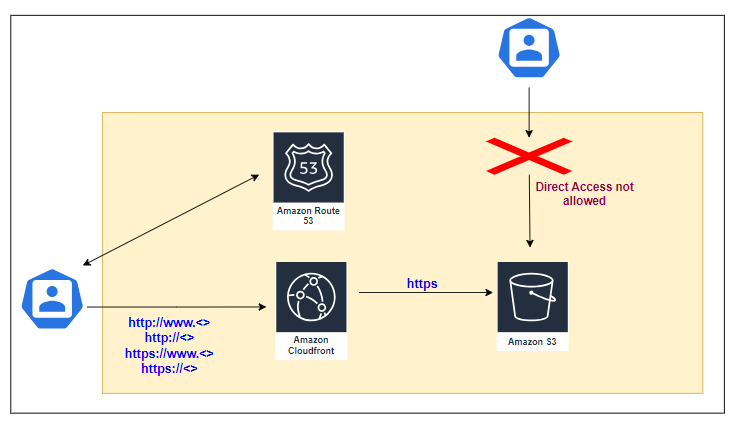

# Architecture

# Pre-Requisites

1.	Terraform installed in your machine
2.	AWS CLI profile (To authenticate with AWS Cloud from Terraform. Better to use this approach rather than hardcoding the credentials directly in the file)

# Resources created

- S3 bucket
- CloudFront pointing to S3 bucket
- HTTPS certificate in AWS Certificate Manager (Same R53 domain name)
- R53 Alias record pointing to CloudFront

# Terraform.tfvars variables

| Variable            | Purpose                                                                   |
|---------------------|---------------------------------------------------------------------------|
| root_domain_name    | The top domain name                                                       |
| aws_route53_zone_id | Zone ID of AWS Public Zone to create DNS records for the domain names pointing to CloudFront |
| bucket_name         | Unique bucket name. It can be anything (No need to match the domain name) |
| project             | Just one word description of this project. It is used to add comments and add tags to the resources |
| root-object         | Root webpage file (Example Index.html)                                   |
| price_class         | Price Class of CloudFront                                                |
| web_folder          | The webpage folder in the local machine. Currently, Terraform is configured to upload individual files recursively |

# How to Execute

1.	Fill the terraform.tfvars
2.	Update the profile information in provider.tf 
(Leave the region to us-east-1 as the CloudFront always needs to be created in that region. It will serve the global users via the edge locations in all regions.
3.	Issue “terraform init”
4.	Issue “terraform plan”
5.	To create the resources “terraform apply -auto-approve”
6.	Leave 5-10 minutes after resource creation and access the domain name
7.	To destroy the resources “terraform destroy -auto-approve”

# Developer 
K.Janarthanan
